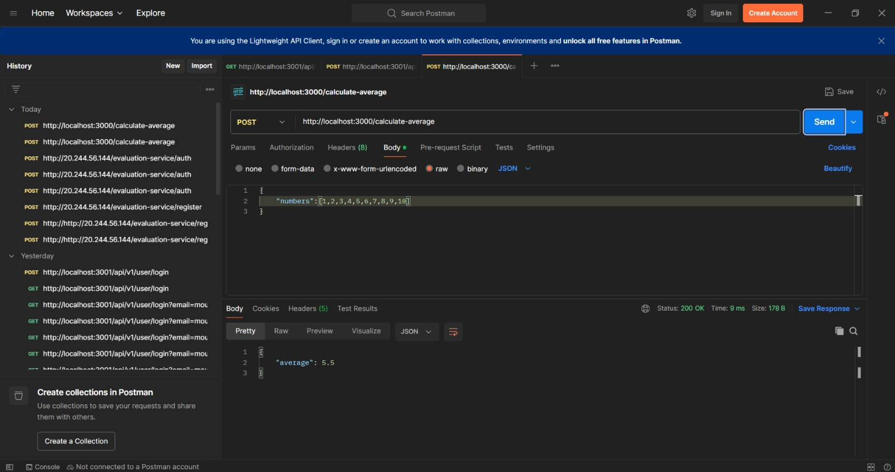
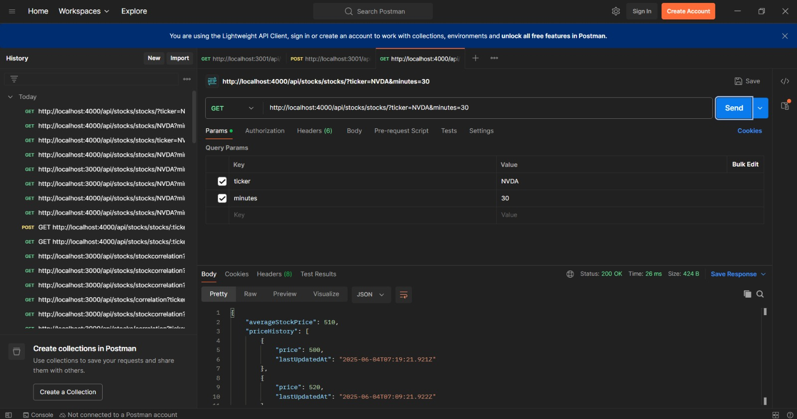
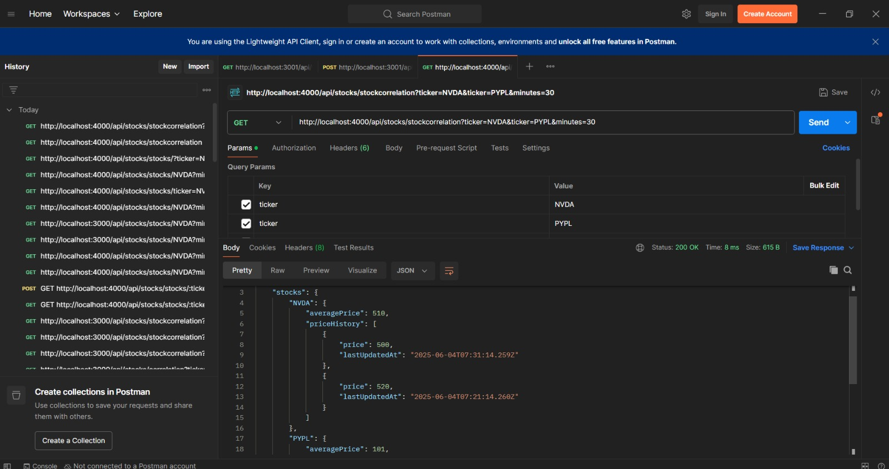

# 22510965
Afford Medical Technology Pvt.limited Full stack development Assessment.


* Q1-averageCalculator

1) Clone the repo using url:- https://github.com/CoderRahul9904/22510965.git
2) Open the folder in any code editor
3) Run the below to start the server

```bash
cd q1-averageCalculator
node app.js
```
- **Request**:
{
    "numAverage": [1,2,3,4,5,6,7,8,9,10]
}

- **Response**:
{
    "average": 5.5(interger)
}

Below is the screenshot for q1:-




* Q2 Stock Price Aggregation

```bash
cd q2-spAggregation
npm run dev
```



Aggregation of two Tickets output




### Note: I was'nt able to make client ui for Q2